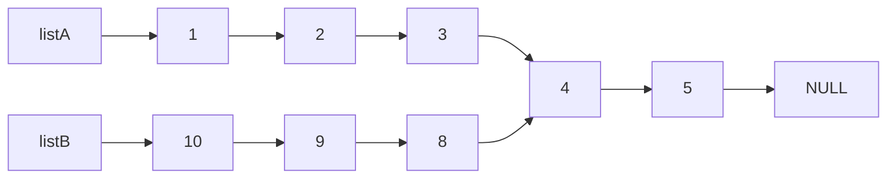
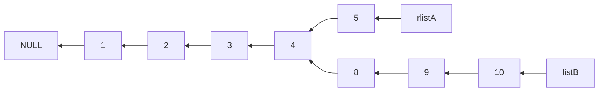
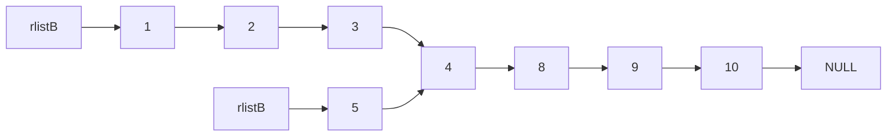

# [两链表中寻找公共节点](https://leetcode.cn/problems/intersection-of-two-linked-lists/description/)


我的第一个想法是，将两个链表直接反转，若头结点不共用，那就肯定不相交。然后逐个遍历，看到哪里分叉。注意，题目已经说明，这两个链表一定不为空。

```c
struct ListNode* reverseList(struct ListNode* head) {
    struct ListNode* PLast = NULL;
    struct ListNode* PCurrent = head;
    struct ListNode* PNext = head;
    while (PCurrent) {
        PNext = PCurrent->next;
        PCurrent->next = PLast;
        PLast = PCurrent;
        PCurrent = PNext;
    }
    return PLast;
}

struct ListNode* getIntersectionNode(struct ListNode* headA,
                                     struct ListNode* headB) {
    assert(headA && headB);
    headA = reverseList(headA);
    headB = reverseList(headB);
    if (headA != headB) {
        return NULL;
    } else {
        struct ListNode* currentA = headA;
        struct ListNode* currentB = headB;
        while (currentA && currentB && currentA->next == currentB->next) {
            currentA = currentA->next;
            currentB = currentB->next;
        }
        return currentA;
    }
}
```

不过，这个算法完全不可行。为什么呢？

假设`listA`和`listB`存在公共节点



倒置`listA`后，会有



再倒置`listB`就会有



这警示我们，当有多个链表存在时，若要倒置某个链表，一定要检查这些链表有没有公共节点，不过 ，个人认为这种存在公共节点的情况很难遇到。

究竟怎么解决呢？先求得这两个链表的节点数目，让更长的链表先走，走到剩下长度与短链表长度一致的时候，再让短链表走，每走一步，看看它们的节点是否共有。

```c
struct ListNode* getIntersectionNode(struct ListNode* headA,
                                     struct ListNode* headB) {
    assert(headA && headB);
    struct ListNode* TerminatorA = headA;
    struct ListNode* TerminatorB = headB;
    int countA = 1;
    int countB = 1;
    while (TerminatorA->next) {
        TerminatorA = TerminatorA->next;
        countA++;
    }
    while (TerminatorB->next) {
        TerminatorB = TerminatorB->next;
        countB++;
    }
    if (TerminatorA != TerminatorB) {
        return NULL;
    } else {
        int advance = abs(countA - countB);
        struct ListNode* currentShort = headA;
        struct ListNode* currentLong = headB;
        if (countA > countB) {
            currentShort = headB;
            currentLong = headA;
        }
        while (advance--) {
            currentLong = currentLong->next;
        }
        while (currentLong != currentShort) {
            currentLong = currentLong->next;
            currentShort = currentShort->next;
        }
        return currentLong;
    }
}
```

