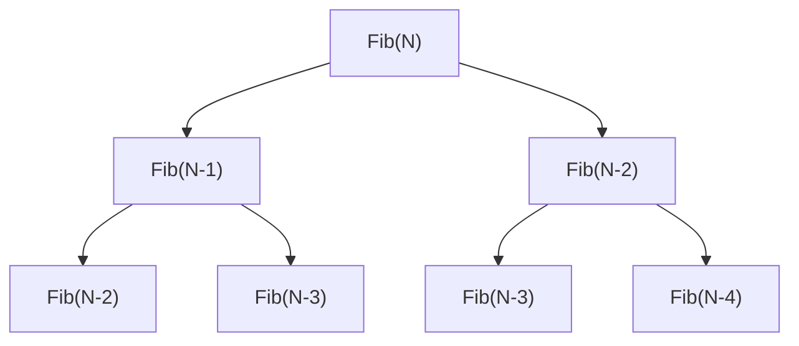

# 复杂度讲解

## 前言

1. 什么是数据结构

   数据结构是计算机科学中的一种组织和存储数据的方式，用来对数据进行有效的访问和修改。数据结构不仅仅是数据的存储形
   式，还包括对这些数据进行操作的一些算法和方法。数据结构有多种，不同的数据结构适用于不同类型的应用和问题。没有最好的数据结构，只有最合适的数据结构。

2. 什么是算法

   算法(Algorithm):就是定义良好的计算过程，他取一个或一组的值为输入，并产生出一个或一组值作为输出。简单来说算法就是一系列的计算步骤，用来将输入数据转化成输出结果。  

3. 数据结构和算法的重要性

   对于程序员来说，数据结构与算法是一项基本功，各大公司在招聘时对它们也有较高的要求。数据结构与算法之间是一种你中有我，我中有你的关系，无法完全剥离成两个独立部分。

## 算法的时间复杂度和空间复杂度  

算法效率

如何判断一个算法的好坏呢？我们主要从两个方向——时间复杂度和空间复杂度来看。通俗的来说，时间复杂度是指算法跑的快不快，空间复杂度指算法到底占用了多少内存。

- 时间复杂度：从理论上来讲，时间复杂度就是看这个算法跑一次用多长时间，但实际上，我们并不用运行时间的长短去衡量一个算法的时间复杂度，因为算法完整跑一轮的时间不仅与算法本身有关，更和运行这个算法的计算机有关。同一款电脑游戏，在某些性能好的电脑上就跑的很好，但在另一些电脑上，跑得可能就不怎样，甚至跑不起来。
- 空间复杂度：和时间复杂度类型，只不过时间复杂度算的是执行次数，而空间复杂度算的是变量的个数。

### 时间复杂度

刚才我们说，时间复杂度不能单纯的用算法的运行时间去衡量，那这时间复杂度我们到底是用什么方式衡量的呢？在计算机科学中，时间复杂度是一个函数（不是编程里的子程序，而是数学上的函数），这个函数可以不考虑硬件性能去纯粹地描述一个算法的运行时间。物理当中也有相似的做法，比如对于一个电磁场来说，我们并不是直接用带电粒子在电场中的受力大小去衡量电场的强弱，而是把带电粒子所受的力除以带电粒子本身的带电量所得到的结果作为场强的标量。一个算法的运行时间与其中基本语句的执行次数正相关，**算法中的基本操作的执行次数，就是算法的时间复杂度**。  

举个例子，比如这个算法（或者说子程序）：

```c
void Func1(int N)
{
    int count = 0;
    for (int i = 0; i < N ; ++ i)
    {
        for (int j = 0; j < N ; ++ j)
        {
            ++count;
        }
    }
    for (int k = 0; k < 2 * N ; ++ k)
    {
        ++count;
    }
    int M = 10;
    while (M--)
    {
        ++count;
    }
    printf("%d\n", count);
}
```

你看这个算法里面一共有三个循环，一个二级循环，两个一级循环，二级循环的次数是`N*N`，第一个一级循环次数是`2*N`，第二个一级循环的次数是10；如果用$F(N) $来表示该算法的时间复杂度，便有
$$
F(N) = N^2+2N+10
$$
不过，在实际开发过程中，我们不会弄得这么精确，连数学表达式都写出来了，而是采用估算的方式来表达时间复杂度，当然，这个估算的表达式不是随便取的，而是要与原函数表达式有如下关系：

在N趋近于无穷大时，估算表达式$O(N) $与函数表达式$F(N) $之间的相对误差趋近于某个常数，表现出渐近相似性。换言之，在N趋近于无穷大时，实际表达式$F(N) $ 和估算表达式$O(N) $之间的差异不会无限增大，而是保持在一个相对稳定的范围内，即$F(N) $的复杂度可以用 $O(N) $来近似。

在上面的例子中，可假设
$$
O(N) = N^2
$$
为原函数的估算表达式，当N趋近于无穷大时，这两个表达式之间表现出渐近相似性。

则它们之间的差值可用$D(N) $来表示，有
$$
D(N) = F(N)-O(N)=N^2+2N+10-N^2=2N+10
$$
其相对误差便为
$$
E_r(N) =\frac{D(N)}{F(N)}=\frac{2N+10}{N^2+2N+10}=\frac{2+\frac{10}{N}}{N+2+\frac{10}{N}}
$$
当N趋向于无穷时，有
$$
\lim_{N \to ∞} E_r(N)=\lim_{N \to ∞} \frac{2+\frac{10}{N}}{N+2+\frac{10}{N}}=0
$$
取极限的结果是常数，得证，假设成立。

简单的来说，估算表达式就是阶数最高的那一项。而在计算机科学中，我们会把
$$
O(N) = N^2
$$
简写成
$$
O(N^2)
$$
前面说的，光看阶数最高的一项，总结得并不全面，我们先找几个例子，来实际感受感受。

```c
void Func3(int N, int M)
{
    int count = 0;
    for (int k = 0; k < M; ++ k)
    {
        ++count;
    }
    for (int k = 0; k < N ; ++ k)
    {
        ++count;
    }
    printf("%d\n", count);
}
```

这里有两个参数，而且没有特别说明，其中的某个参数特别大，以致可以忽略另一个参数，所以两个参数都要考虑，换言之，这个算法的时间复杂度是二元的，二元的可以拆成两个一元来处理.

比如对于

```c
for (int k = 0; k < M; ++ k)
{
    ++count;
}
```

其复杂度就是$O(M) $

而对于

```c
for (int k = 0; k < N ; ++ k)
{
    ++count;
}
```

其复杂度就是$O(N) $;

所以，对于这整个算法来说，其复杂度就是
$$
O(M+N)
$$
再看下一个例子

```c
void Func4(int N)
{
    int count = 0;
    for (int k = 0; k < 100; ++ k)
    {
        ++count;
    }
    printf("%d\n", count);
}
```

这里写$O(100) $吗？在计算机发展早期，或许确实是这样写的，因为那时的CPU速度较慢，循环一百次和循环一亿次人是能明显感受到差距的，但现在，由于CPU的速度大大提升，循环一百次和循环一亿次人已经感受不到明显差距了，因此$O(100) $这种写法就失去了意义。实际上，对于常数次执行的算法，我们不管具体是多少次，一律写成
$$
O(1)
$$
的形式，这里的“1”表示的不是执行一次，而是执行常数次数。而且，即使就让$O(N)=1 $带入前面的数学证明，最终取极限得到的结果也确实是常数。

再来个例子

```c
void Func2(int N)
{
    int count = 0;
    for (int k = 0; k < 2 * N ; ++ k)
    {
        ++count;
    }
    int M = 10;
    while (M--)
    {
        ++count;
    }
    printf("%d\n", count);
}
```

这里的时间复杂度是$O(2N) $吗？也不是，和前面的原因差不多，乘常数只是量变，不是质变，所以我们将参数因子省略，使之变为
$$
O(N)
$$
再来

```c
const char * strchr ( const char * str, int character );
```

这里的实际执行次数要看具体情况，有可能是第一个字符就找到了，也有可能字符串都遍历完了也找不到，那我们到底选哪个呢？我们选择最悲观的那一个，此举主要是提高容错率和降低预期，就像抽卡游戏大保底，准备180抽肯定能把那个角色拿下，防止运气不好，抽不到喜欢的角色。在把执行次数定死在最坏情况的前提下，同样也可以依据上述模式证明。（不定死的话，也不是函数关系）
$$
O(N)
$$
你说这里参数没有N是吧？函数重要的是关系，而不是代指未知数的字母，这里的N指的就是那个影响执行次数的数字，在此处，就是字符串`str`的长度。

next

```c
void BubbleSort(int* a, int n)
{
    assert(a);
    for (size_t end = n; end > 0; --end)
    {
        int exchange = 0;
        for (size_t i = 1; i < end; ++i)
        {
            if (a[i-1] > a[i])
            {
                Swap(&a[i-1], &a[i]);
                exchange = 1;
            }
        }
        if (exchange == 0)
            break;
    }
}
```

这是一个基础版的冒泡排序，执行次数是通项为
$$
a_n=n
$$
的等差数列前N-1项和，即
$$
F(N) = \frac{N}{2}(1+N)-N
$$
so
$$
O(N^2)
$$
next

```c
int BinarySearch(int* a, int n, int x)
{
    assert(a);
    int begin = 0;
    int end = n-1;
    while (begin < end)
    {
        int mid = begin + ((end-begin)>>1);
        if (a[mid] < x)
            begin = mid+1;
        else if (a[mid] > x)
            end = mid;
        else
            return mid;
    }
    return -1;
}
```

这个是二分查找，这怎么算呢？二分查找每次循环都会删掉一半数据，那我们反着看，最后一次循环是个什么场景，不就开始下标和结束下标中间只隔了一个数吗？那数组最开始有N个数据，最后只有一个数据，每执行一次筛掉一半数据，所以只要看N除以多少次2能得到一就行了，即
$$
\frac{N}{2^{F(N)}}=1
$$
整理有
$$
F(N)=log_2N
$$
故时间复杂度为
$$
O(log_2N)
$$
这里就可知直观感受到二分查找比冒泡的优越性，就比如现在有$2^{50} $次方数据，用冒泡最坏要查$2^{100} $次，二分最坏查50次，但二分也有硬伤，如果数据是乱序的话，二分查找根本不能用。应用场景很窄，只是看上去厉害。如果我们以后自己写算法，时间复杂度最多是$O(N^2) $，绝对不能再多了，再多没有实际价值。

下一个

```c
long long Fac(size_t N)
{
    if(0 == N)
        return 1;
    return Fac(N-1)*N;
}
```

这次是递归了，是求阶乘的，问题不大，你看这初始是`Fac(N)`，末尾是`Fac(0)`，每执行一次参数减一，那如果N就是1，那是不是执行一次就到`Fac(0)`，了？so
$$
F(N)=N
$$
namely
$$
O(N)
$$
稍微改一改

```c
long long Fac(size_t N)
{
    if(0 == N)
        return 1;
    
    for(size_t i = 0; i < N; i++);
    return Fac(N-1)*N;
}
```

这次又是什么呢？这也问题不大，我们可以把执行分成大执行和小执行两种，每大执行一次参数减一，每大执行里又有参数个小执行，最后执行次数就是一个等差数列的前N项和。时间复杂度是估算，它又是等差数列的前N项和，不用算就知道，时间复杂度是
$$
O(N^2)
$$
或者你可以看另一种等差数列求和公式
$$
S_N=\frac{N}{2}(2a_1+(N-1)d)
$$
等差数列$d $是常数，不看，$a_1 $也是常数，不看，其它常数都是什么加减乘除，也可以不看，最后不就剩个$N^2$了吗。

即使它算的不是前N项和，而是中间N项的和，复杂度也是$O(N)$。比如说，现在我们要算$C$到$C+N$项，那怎么算呢？拿大的减小的不就行了
$$
S_{C+N}-S_C=\frac{C+N}{2}(2a_1+(C+N-1)d)-\frac{C}{2}(2a_1+(C-1)d)
$$
后面不就一个常数吗？也能省略。也就是说，等差数列型算法时间复杂度都是$N^2$，不用去关心公差和从哪一项开始或结束。

下一个：

```c
long long Fib(size_t N)
{
    if(N < 3)
        return 1;
    return Fib(N-1) + Fib(N-2);
}
```

这要画二叉树了：



我们可以看到，每执行一次，就会产生两个分支，第一个间隔产生了两个分支，所以是执行一次；第二个间隔产生了四个分支，所以执行了两次；第三个间隔产生了八个分支，所以执行了四次；以此类推，可以知道第$X$个间隔执行$2^X$次，这不就是一个等比数列吗？所以总的执行次数可以用等比数列和的公式来计算：
$$
S_N=a_1\frac{1-r^N}{1-r}=a_1(\frac{1}{1-r}-\frac{r^N}{1-r})
$$
在其中$a_1$,$\frac{1}{1-r}$,$-\frac{1}{1-r}$都是常数，可以省略，那就剩下了$r^N$，这里公比为2，所以复杂度就是
$$
O(2^N)
$$
当然，N=2时就会停止，但和上面的等差数列一样，不用关心它到底在哪停止，就是多个常数的事。复杂度只是估算。公式记不得可以上网查，如果是因为某些原因查不了网，那也可以不用公式，用错位相减法，这个算法的停止条件是N=2，N到2有(N-2)个间隔，设$F(N)$是该算法精确时间复杂度函数，有
$$
F(N) = 2^0+2^1+2^3+2^4+……+2^{N-4}+2^{N-3}+2^{N-2}
$$

$$
2F(N)=2^1+2^3+2^4+……+2^{N-3}+2^{N-2}+2^{N-1}
$$

$$
F(N)=2F(N)-F(N)=2^{N-1}-2^0=2^{N-1}-1=\frac{2^N}{2}-1
$$

则复杂度是
$$
O(2^N)
$$
好，下面我们找几个题目来做一做

题目一：[消失的数字](https://leetcode.cn/problems/missing-number-lcci/description/)


我第一个想到的办法就是暴力破解，先排序，再遍历，看哪里不连续，但很明显这个想法不能用，因为光排序的复杂度就已经超过$N$了，所以根本不用去试着写；第二个方法，用异或，异或是相同为0，相异为1，由此可以引申出两条性质：两个相同的数，异或为0；某个数与0异或，得到的还是这个数；异或还具有交换律，这是因为异或比较的是对应的位是否相同，两个数谁在前谁在后并不会影响这两个数是否相同，即`A^B==B^A`。具体怎么做呢？我们先把0-N的数都异或一下，再拿这个结果去异或数组里的所有成员，比如假设现在n就是3，缺的那个数字就是1，那就`0^1^2^3^0^2^3`，由于异或有交换律，所以可以调整为`(0^0)^(2^2)^(3^3)^1`，最后结果是`0^1`得到1。它的复杂度是$O(N)$，符合题目要求，可以采纳。

```c
int missingNumber(int* nums, int numsSize) {
    int ret = 0;
    int i = 0;
    for (i = 0; i <= numsSize; i++) {
        ret ^= i;
    }
    for (i = 0; i < numsSize; i++) {
        ret ^= nums[i];
    }
    return ret;
}
```

第三个算法，数组里的成员不就是等差数列缺了一项吗？那我可以拿对应等差数列的和减去数组所有成员的和，不就得到了缺失的那一项了吗？这个算法的复杂度是$O(N)$，也符合题目要求。

```c
int missingNumber(int* nums, int numsSize) {
    int seqsum = 0;
    int arrsum = 0;
    int i = 0;
    seqsum = (1 + numsSize) * numsSize / 2;
    for (i = 0; i < numsSize; i++) {
        arrsum += nums[i];
    }
    return seqsum - arrsum;
}
```

这里讲个题外话，力扣左边的统计是有问题的，即使是同样的代码，两次提交统计结果也可能不同，不要有心里负担，只要过了就行了。

### 空间复杂度

空间复杂度也是一个数学表达式，是对一个算法在运行过程中**临时占用存储空间大小的量度** 。  空间复杂度不是程序占用了多少bytes的空间，因为这个也没太大意义，所以空间复杂度算的是变量的个数。空间复杂度计算规则基本跟时间复杂度类似，也使用这种$O$表示法。注意：**函数运行时所需要的栈空间存储参数、局部变量、一些寄存器信息等在编译期间已经确定好了，因此空间复杂度主要通过函数在运行时候显式申请的额外空间来确定，什么是额外空间？额外空间就是自己开辟的空间。**  

```c
void BubbleSort(int* a, int n)
{
    assert(a);
    for (size_t end = n; end > 0; --end)
    {
        int exchange = 0;
        for (size_t i = 1; i < end; ++i)
        {
            if (a[i-1] > a[i])
            {
                Swap(&a[i-1], &a[i]);
                exchange = 1;
            }
        }
        if (exchange == 0)
            break;
    }
}
```

可以看到，这里就创建了一（常数）个变量`exchange`，所以空间复杂度就是
$$
O(1)
$$
形参不是你开辟的，所以一般不用看。即使算上了，由于它传的是指针，所以还是常数个。

下一个

```c
long long* Fibonacci(size_t n)
{
    if(n==0)
        return NULL;
    long long * fibArray = (long long *)malloc((n+1) * sizeof(long long));
    fibArray[0] = 0;
    fibArray[1] = 1;
    for (int i = 2; i <= n ; ++i)
    {
        fibArray[i] = fibArray[i - 1] + fibArray [i - 2];
    }
    return fibArray;
}
```

指针`fibArray`也就创建一个，主体还是动态开辟的`(n+1)`数组，所以空间复杂度是
$$
O(N)
$$
下一个

```c
long long Fac(size_t N)
{
    if(N == 0)
        return 1;
    return Fac(N-1)*N;
}
```

这是递归，尽管单个函数栈帧连一个变量也没开辟，但它会开辟出N个函数栈帧，函数栈帧里还有一些其它东西，所以空间复杂度是
$$
O(N)
$$
下一个

```c
long long Fib(size_t N)
{
    if(N < 3)
        return 1;
    return Fib(N-1) + Fib(N-2);
}
```

也许一开始你会认为空间复杂度是$O(2^N)$，但实际上，空间复杂度是
$$
O(N)
$$
为什么呢？这要画时序图：（为了方便表示，这里的N当做10）

```mermaid
sequenceDiagram
    participant Fib(10)
    participant Fib(9)
    participant Fib(8)
    participant Fib(7)
    participant Fib(6)
    participant Fib(5)
    participant Fib(4)
    participant Fib(3)
    participant Fib(2)
    participant Fib(1)
    
    Fib(10) --> Fib(9):开辟
    Fib(9) --> Fib(8):开辟
    Fib(8) --> Fib(7):开辟
    Fib(7) --> Fib(6):开辟
    Fib(6) --> Fib(5):开辟
    Fib(5) --> Fib(4):开辟
    Fib(4) --> Fib(3):开辟
    Fib(3) --> Fib(2):开辟
    Fib(2) --> Fib(3):回收
    Fib(3) --> Fib(1):开辟
    Fib(1) --> Fib(3):回收
    Fib(3) --> Fib(4):回收
    Fib(4) --> Fib(2):开辟
    Fib(2) --> Fib(4):回收
    Fib(4) --> Fib(5):回收
    Fib(5) --> Fib(3):开辟
    Fib(3) --> Fib(2):开辟
    Fib(2) --> Fib(3):回收
    Fib(3) --> Fib(1):开辟
    Fib(1) --> Fib(3):回收
    Fib(3) --> Fib(5):回收
    Fib(5) --> Fib(6):回收
    Fib(6) --> Fib(4):开辟
    Fib(4) --> Fib(3):开辟
    Fib(3) --> Fib(2):开辟
    Fib(2) --> Fib(3):回收
    Fib(3) --> Fib(1):开辟
    Fib(1) --> Fib(3):回收
    Fib(3) --> Fib(4):回收
    Fib(4) --> Fib(2):开辟
    Fib(2) --> Fib(4):回收
    Fib(4) --> Fib(6):回收
    Fib(6) --> Fib(7):回收
    Fib(7) --> Fib(5):开辟
    Fib(5) --> Fib(4):开辟
    Fib(4) --> Fib(3):开辟
    Fib(3) --> Fib(2):开辟
    Fib(2) --> Fib(3):回收
    Fib(3) --> Fib(1):开辟
    Fib(1) --> Fib(3):回收
    Fib(3) --> Fib(4):回收
    Fib(4) --> Fib(2):开辟
    Fib(2) --> Fib(4):回收
    Fib(4) --> Fib(5):回收
    Fib(5) --> Fib(3):开辟
    Fib(3) --> Fib(2):开辟
    Fib(2) --> Fib(3):回收
    Fib(3) --> Fib(1):开辟
    Fib(1) --> Fib(3):回收
    Fib(3) --> Fib(5):回收
    Fib(5) --> Fib(7):回收
    Fib(7) --> Fib(8):回收
    Fib(8) --> Fib(6):开辟
    Fib(6) --> Fib(5):开辟
    Fib(5) --> Fib(4):开辟
    Fib(4) --> Fib(3):开辟
    Fib(3) --> Fib(2):开辟
    Fib(2) --> Fib(3):回收
    Fib(3) --> Fib(1):开辟
    Fib(1) --> Fib(3):回收
    Fib(3) --> Fib(4):回收
    Fib(4) --> Fib(2):开辟
    Fib(2) --> Fib(4):回收
    Fib(4) --> Fib(5):回收
    Fib(5) --> Fib(3):开辟
    Fib(3) --> Fib(2):开辟
    Fib(2) --> Fib(3):回收
    Fib(3) --> Fib(1):开辟
    Fib(1) --> Fib(3):回收
    Fib(3) --> Fib(5):回收
    Fib(5) --> Fib(6):回收
    Fib(6) --> Fib(4):开辟
    Fib(4) --> Fib(3):开辟
    Fib(3) --> Fib(2):开辟
    Fib(2) --> Fib(3):回收
    Fib(3) --> Fib(1):开辟
    Fib(1) --> Fib(3):回收
    Fib(3) --> Fib(4):回收
    Fib(4) --> Fib(2):开辟
    Fib(2) --> Fib(4):回收
    Fib(4) --> Fib(6):回收
    Fib(6) --> Fib(8):回收
    Fib(8) --> Fib(9):回收
    Fib(9) --> Fib(7):开辟
    Fib(7) --> Fib(6):开辟
    Fib(6) --> Fib(5):开辟
    Fib(5) --> Fib(4):开辟
    Fib(4) --> Fib(3):开辟
    Fib(3) --> Fib(2):开辟
    Fib(2) --> Fib(3):回收
    Fib(3) --> Fib(1):开辟
    Fib(1) --> Fib(3):回收
    Fib(3) --> Fib(4):回收
    Fib(4) --> Fib(2):开辟
    Fib(2) --> Fib(4):回收
    Fib(4) --> Fib(5):回收
    Fib(5) --> Fib(3):开辟
    Fib(3) --> Fib(2):开辟
    Fib(2) --> Fib(3):回收
    Fib(3) --> Fib(1):开辟
    Fib(1) --> Fib(3):回收
    Fib(3) --> Fib(5):回收
    Fib(5) --> Fib(6):回收
    Fib(6) --> Fib(4):开辟
    Fib(4) --> Fib(3):开辟
    Fib(3) --> Fib(2):开辟
    Fib(2) --> Fib(3):回收
    Fib(3) --> Fib(1):开辟
    Fib(1) --> Fib(3):回收
    Fib(3) --> Fib(4):回收
    Fib(4) --> Fib(2):开辟
    Fib(2) --> Fib(4):回收
    Fib(4) --> Fib(6):回收
    Fib(6) --> Fib(7):回收
    Fib(7) --> Fib(5):开辟
    Fib(5) --> Fib(4):开辟
    Fib(4) --> Fib(3):开辟
    Fib(3) --> Fib(2):开辟
    Fib(2) --> Fib(3):回收
    Fib(3) --> Fib(1):开辟
    Fib(1) --> Fib(3):回收
    Fib(3) --> Fib(4):回收
    Fib(4) --> Fib(2):开辟
    Fib(2) --> Fib(4):回收
    Fib(4) --> Fib(5):回收
    Fib(5) --> Fib(3):开辟
    Fib(3) --> Fib(2):开辟
    Fib(2) --> Fib(3):回收
    Fib(3) --> Fib(1):开辟
    Fib(1) --> Fib(3):回收
    Fib(3) --> Fib(5):回收
    Fib(5) --> Fib(7):回收
    Fib(7) --> Fib(9):回收
    Fib(9) --> Fib(10):回收
    Fib(10) --> Fib(8):开辟
    Fib(8) --> Fib(7):开辟
    Fib(7) --> Fib(6):开辟
    Fib(6) --> Fib(5):开辟
    Fib(5) --> Fib(4):开辟
    Fib(4) --> Fib(3):开辟
    Fib(3) --> Fib(2):开辟
    Fib(2) --> Fib(3):回收
    Fib(3) --> Fib(1):开辟
    Fib(1) --> Fib(3):回收
    Fib(3) --> Fib(4):回收
    Fib(4) --> Fib(2):开辟
    Fib(2) --> Fib(4):回收
    Fib(4) --> Fib(5):回收
    Fib(5) --> Fib(3):开辟
    Fib(3) --> Fib(2):开辟
    Fib(2) --> Fib(3):回收
    Fib(3) --> Fib(1):开辟
    Fib(1) --> Fib(3):回收
    Fib(3) --> Fib(5):回收
    Fib(5) --> Fib(6):回收
    Fib(6) --> Fib(4):开辟
    Fib(4) --> Fib(3):开辟
    Fib(3) --> Fib(2):开辟
    Fib(2) --> Fib(3):回收
    Fib(3) --> Fib(1):开辟
    Fib(1) --> Fib(3):回收
    Fib(3) --> Fib(4):回收
    Fib(4) --> Fib(2):开辟
    Fib(2) --> Fib(4):回收
    Fib(4) --> Fib(6):回收
    Fib(6) --> Fib(7):回收
    Fib(7) --> Fib(5):开辟
    Fib(5) --> Fib(4):开辟
    Fib(4) --> Fib(3):开辟
    Fib(3) --> Fib(2):开辟
    Fib(2) --> Fib(3):回收
    Fib(3) --> Fib(1):开辟
    Fib(1) --> Fib(3):回收
    Fib(3) --> Fib(4):回收
    Fib(4) --> Fib(2):开辟
    Fib(2) --> Fib(4):回收
    Fib(4) --> Fib(5):回收
    Fib(5) --> Fib(3):开辟
    Fib(3) --> Fib(2):开辟
    Fib(2) --> Fib(3):回收
    Fib(3) --> Fib(1):开辟
    Fib(1) --> Fib(3):回收
    Fib(3) --> Fib(5):回收
    Fib(5) --> Fib(7):回收
    Fib(7) --> Fib(8):回收
    Fib(8) --> Fib(6):开辟
    Fib(6) --> Fib(5):开辟
    Fib(5) --> Fib(4):开辟
    Fib(4) --> Fib(3):开辟
    Fib(3) --> Fib(2):开辟
    Fib(2) --> Fib(3):回收
    Fib(3) --> Fib(1):开辟
    Fib(1) --> Fib(3):回收
    Fib(3) --> Fib(4):回收
    Fib(4) --> Fib(2):开辟
    Fib(2) --> Fib(4):回收
    Fib(4) --> Fib(5):回收
    Fib(5) --> Fib(3):开辟
    Fib(3) --> Fib(2):开辟
    Fib(2) --> Fib(3):回收
    Fib(3) --> Fib(1):开辟
    Fib(1) --> Fib(3):回收
    Fib(3) --> Fib(5):回收
    Fib(5) --> Fib(6):回收
    Fib(6) --> Fib(4):开辟
    Fib(4) --> Fib(3):开辟
    Fib(3) --> Fib(2):开辟
    Fib(2) --> Fib(3):回收
    Fib(3) --> Fib(1):开辟
    Fib(1) --> Fib(3):回收
    Fib(3) --> Fib(4):回收
    Fib(4) --> Fib(2):开辟
    Fib(2) --> Fib(4):回收
    Fib(4) --> Fib(6):回收
    Fib(6) --> Fib(8):回收
    Fib(8) --> Fib(10):回收
    
```



从时序图中我们可以看到，很多函数栈帧都是被反复开辟，又反复回收的，而且由于函数栈帧的大小都是一样的，所以重复开辟又回收的函数栈帧甚至都出现在同一地址处。要注意，空间和时间不同，最起码对于我们所处的四维时空来说（三个空间维，一个时间维），时间的流向是单向的，而空间是可以重复利用的，所以时间复杂度是累加的，而空间复杂度是取最大值的。

再来看个神奇的东西：

```c
#include<stdio.h>

void Func1()
{
	int a = 0;
	printf("%p\n", &a);
}

void Func2()
{
	int b = 1;
	printf("%p\n", &b);
}

int main()
{
	Func1();
	Func2();
	return 0;
}
```

运行一下，发现打印结果是一样的：


为什么呢？因为函数`Func1`和`Func2`的栈帧其实是相同的，在`main`栈帧调用`Func1`并回收之后，再立刻调用`Func2`（而不进行其其它操作），`Func2`的栈帧就会和之前`Func1`的栈帧完美重合，所以这两个函数的变量地址都是一样的。

再来个题目：[旋转数组](https://leetcode-cn.com/problems/rotate-array)

 

第一个算法：暴力破解，仿照示例一，先保存最后一个数，再把数组元素整体向后移一位，最后再把保存的数字写到首元素上；k是多少，就重复上述步骤多少遍，时间复杂度由两个方面决定，一是数组的长度，二是k的长度，k最大是数组长度，所以时间复杂度是$O(N^2)$，空间复杂度是$O(1)$，代码如下：（时间复杂度过高，无法通过）

```c
void rotate(int* nums, int numsSize, int k) {
    k = k % numsSize;
    int moment = 0;
    int cir = 0;
    while (k--) {
        moment = nums[numsSize - 1];
        for (cir = numsSize - 1; cir > 0; cir--) {
            nums[cir] = nums[cir - 1];
        }
        nums[0] = moment;
    }
}
```

第二个算法：空间换时间，临时开辟一个数组，先copy后k个数字，再copy前面的数字，最后再把临时数组整体copy到原数组；时间复杂度为$O(N)$，空间复杂度为$O(N)$，代码如下：

```c
void rotate(int* nums, int numsSize, int k) {
    k = k % numsSize; // 控制k的范围，防止越权访问
    int* pmoment = (int*)malloc(sizeof(int) * numsSize);
    if (pmoment == NULL) {
        perror("rotate:malloc");
        return;
    }
    memcpy(pmoment, nums + numsSize - k, sizeof(int) * k);
    memcpy(pmoment + k, nums, sizeof(int) * (numsSize - k));
    memcpy(nums, pmoment, sizeof(int) * numsSize);
    free(pmoment);
    pmoment = NULL;
}
```

第三个算法：叫做三段倒置法，用到了某些数学原理，具体是什么，下面会说，时间复杂度是$O(N)$，空间复杂度是$O(1)$，代码如下：

```c
void spin(int* arr, int left, int right) {
    int moment = 0;
    while (left < right) {
        moment = arr[right];
        arr[right] = arr[left];
        arr[left] = moment;
        left++;
        right--;
    }
}

void rotate(int* nums, int numsSize, int k) {
    k %= numsSize;
    // 前n-k个逆置：数组下标从0开始，所以第n-k数下标是n-k-1
    spin(nums, 0, numsSize - k - 1);
    // 后k个逆置：所以前面有n-k个数，最后一个数下标是n-k-1,那么下一个数下标就是n-k
    spin(nums, numsSize - k, numsSize - 1);
    // 整体逆置
    spin(nums, 0, numsSize - 1);
}

//以示例一为例：nums = [1,2,3,4,5,6,7], k = 3
//前n-k个逆置：4,3,2,1,5,6,7
//后k个逆置：4,3,2,1,7,6,5
//整体逆置：5,6,7,1,2,3,4
```

